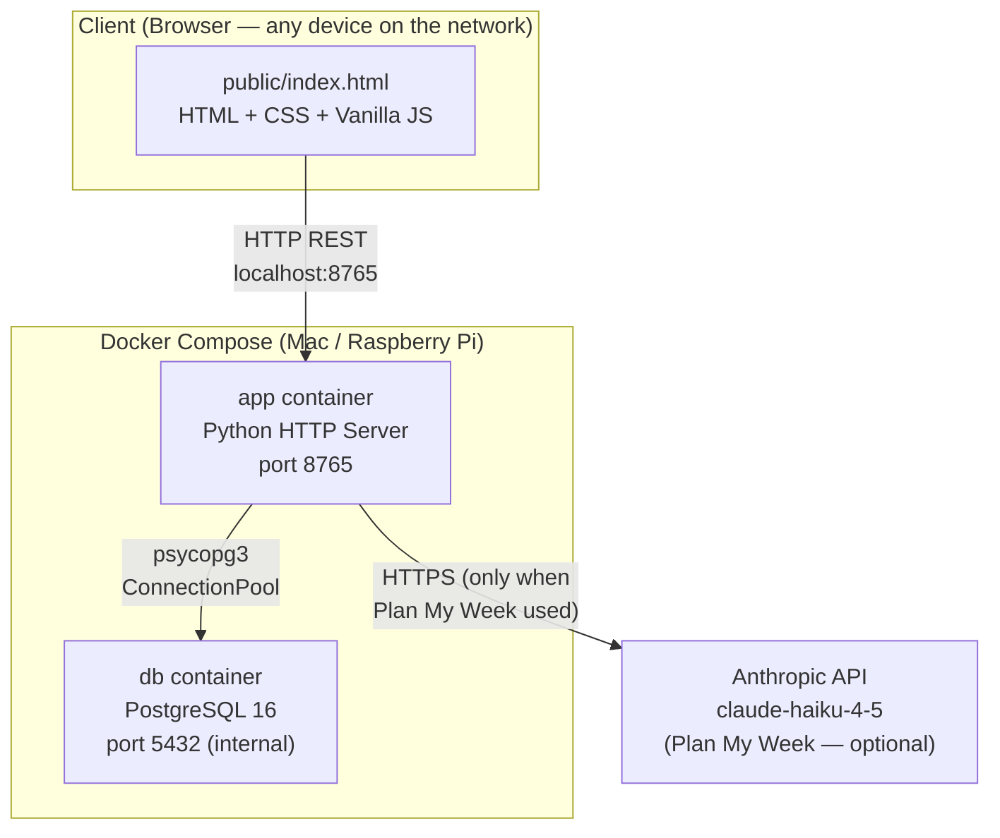
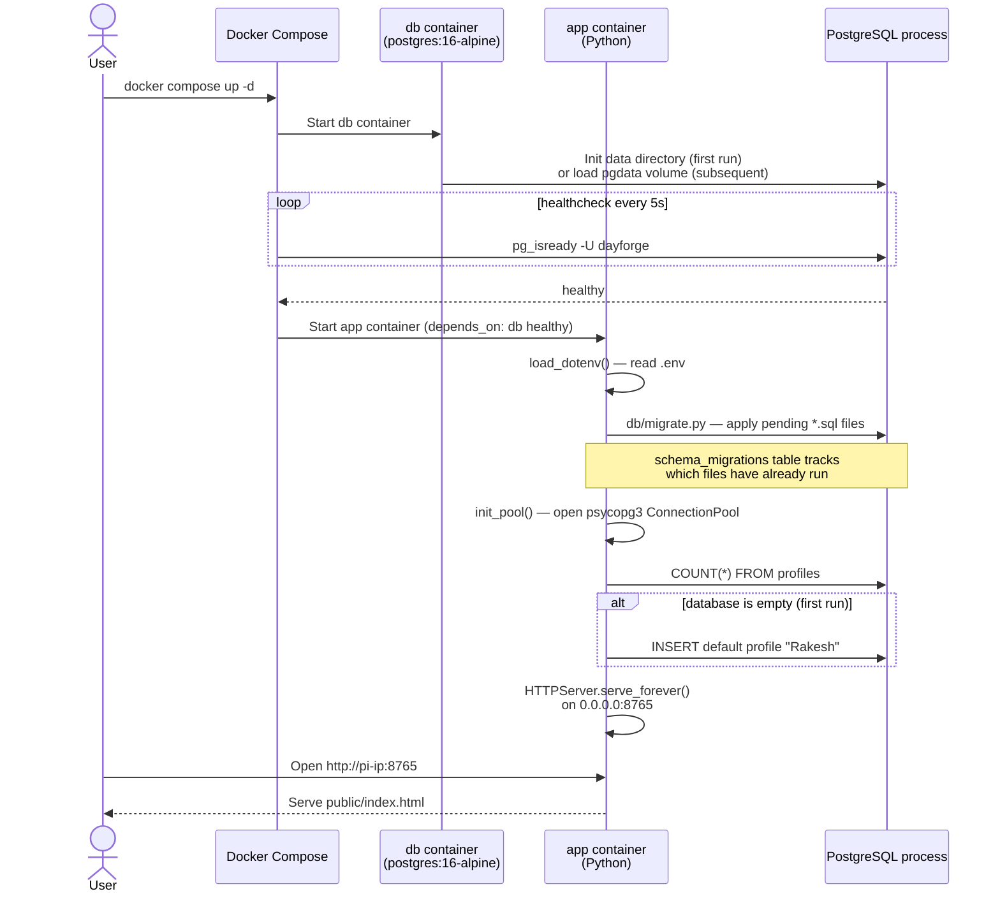
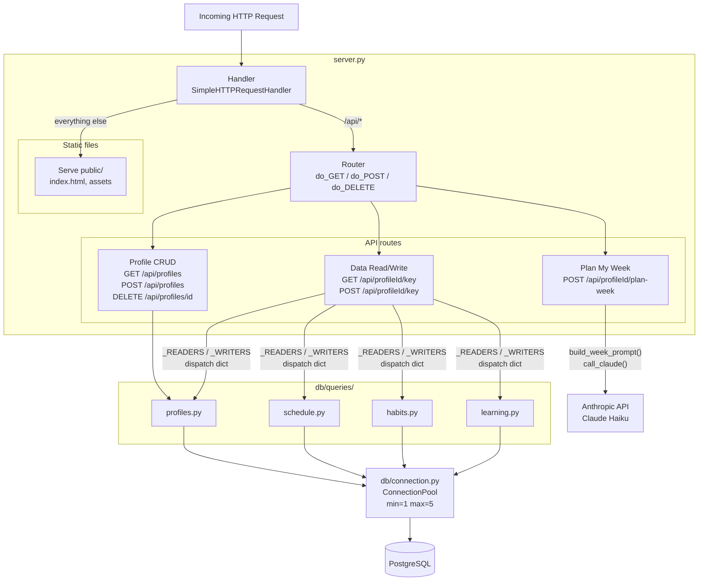
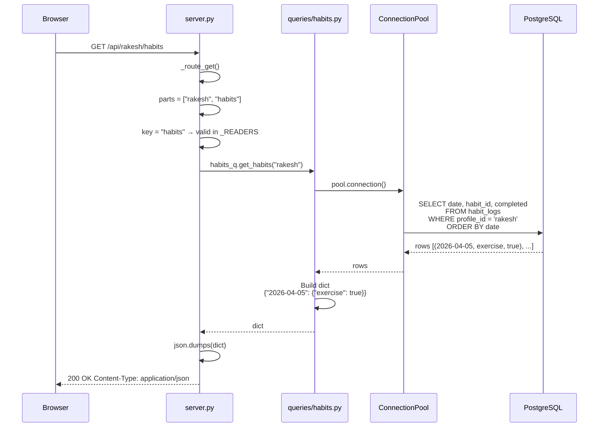
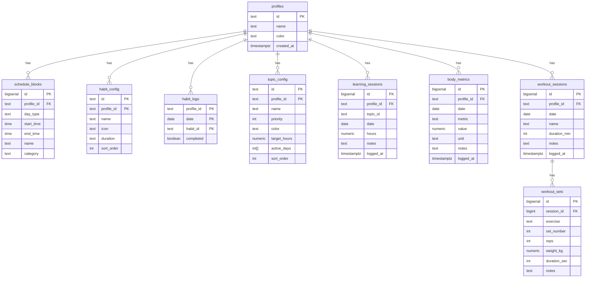
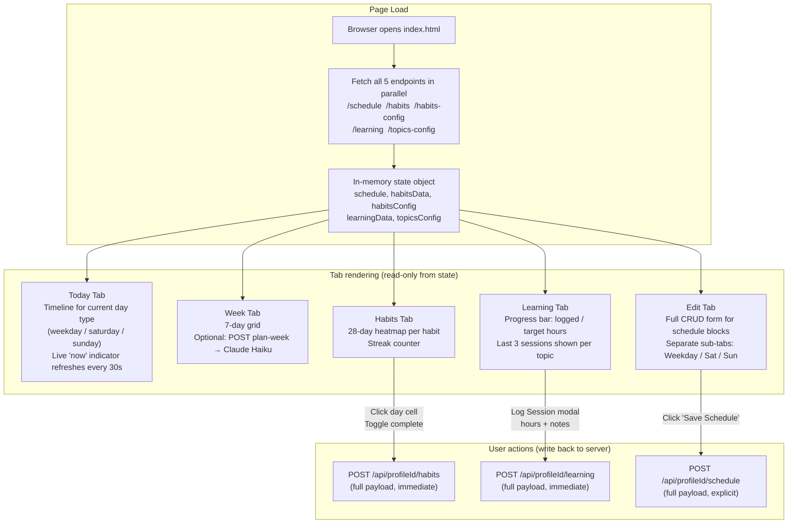
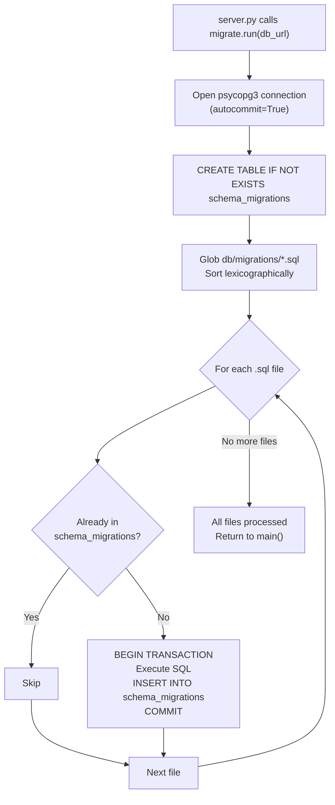

# DayForge — Architecture & Flow Diagrams

Diagrams are written in [Mermaid](https://mermaid.js.org/). They render natively in GitHub, VS Code (with the Markdown Preview Mermaid extension), and Obsidian.

---

## 1. System Architecture

How the pieces fit together at the highest level.



**Key points:**
- The browser and the server are on the same local network — no internet required for normal use.
- PostgreSQL is never exposed outside Docker; only the app container can reach it.
- Anthropic is the only external dependency, and only when the AI planning feature is used.

---

## 2. Docker Compose Startup Sequence

What happens from `docker compose up -d` to a ready server.



---

## 3. Internal Server Architecture

How a request moves through `server.py` and the `db/` layer.



**The dispatch dicts** in `server.py` are the key extensibility point:
```python
_READERS = { "schedule": schedule_q.get_schedule, "habits": habits_q.get_habits, ... }
_WRITERS = { "schedule": schedule_q.save_schedule, "habits": habits_q.save_habits, ... }
```
Adding a new data domain = new migration + new query module + two lines in these dicts. Nothing else changes.

---

## 4. API Request Lifecycle

A complete round-trip for the most common operation: reading profile data.



**Write path** (e.g. POST /api/rakesh/habits) uses DELETE + INSERT in a single transaction — full replacement, matching the old JSON-overwrite behaviour. The frontend always sends the full payload.

---

## 5. Database Schema

Entity-relationship diagram showing all tables and their foreign keys.



**Notes:**
- `habit_config` and `topic_config` use composite PKs `(id, profile_id)` — same habit/topic ID can exist across different profiles.
- `habit_logs` PK is `(profile_id, date, habit_id)` — one row per habit per day, no duplicates possible.
- `body_metrics` is intentionally flexible: `metric` is a free-form string (`"weight_kg"`, `"bmi"`, `"chest_cm"`, etc.). New measurement types need no schema change.
- Tables `body_metrics`, `workout_sessions`, `workout_sets` are in the schema now but have no API endpoints yet.

---

## 6. Frontend Data Flow

How the single-page frontend loads data, renders tabs, and saves changes.



**Save strategy:**
- Habits and Learning save **immediately and silently** on every user action (toggle, log session).
- Schedule saves only when the user explicitly clicks **Save Schedule** — because edits are in-progress forms that shouldn't auto-commit.

---

## 7. Migration System

How `db/migrate.py` ensures the schema stays in sync on every startup.



**Adding a new migration:**
1. Create `db/migrations/0002_your_change.sql`
2. Deploy (or restart the server)
3. It applies automatically — no manual `ALTER TABLE` needed.

Naming convention: `NNNN_description.sql` — the leading number controls order.

---

## 8. Component Map

Where to find each piece of functionality in the codebase.

```
┌─────────────────────────────────────────────────────────┐
│                      server.py                          │
│                                                         │
│  ┌─────────────────┐   ┌──────────────────────────────┐ │
│  │   HTTP routing  │   │     Anthropic integration    │ │
│  │  do_GET         │   │  get_api_key()               │ │
│  │  do_POST        │   │  call_claude()               │ │
│  │  do_DELETE      │   │  build_week_prompt()         │ │
│  │  do_OPTIONS     │   └──────────────────────────────┘ │
│  └────────┬────────┘                                    │
│           │ dispatches to                               │
│  ┌────────▼────────────────────────────────────────┐   │
│  │  _READERS / _WRITERS  (dispatch dicts)          │   │
│  └────────┬────────────────────────────────────────┘   │
└───────────┼─────────────────────────────────────────────┘
            │
┌───────────▼─────────────────────────────────────────────┐
│                    db/queries/                          │
│                                                         │
│  profiles.py      schedule.py                          │
│  ├ list_profiles  ├ get_schedule                        │
│  ├ create_profile ╰ save_schedule                       │
│  ├ delete_profile                                       │
│  ╰ count_profiles  habits.py                            │
│                   ├ get_habit_config                    │
│  learning.py      ├ save_habit_config                   │
│  ├ get_topic_config├ get_habits                         │
│  ├ save_topic_config╰ save_habits                       │
│  ├ get_learning                                         │
│  ╰ save_learning                                        │
│                                                         │
└───────────┬─────────────────────────────────────────────┘
            │ all queries use
┌───────────▼──────────────┐
│   db/connection.py       │
│   ConnectionPool         │
│   init_pool()            │
│   get_pool()             │
│   close_pool()           │
└───────────┬──────────────┘
            │
┌───────────▼──────────────┐
│   PostgreSQL             │
│   (Docker container)     │
└──────────────────────────┘
```

---

## Summary

| Concept | Where it lives |
|---------|---------------|
| HTTP routing | `server.py` — `Handler._route_get/post` |
| Dispatch to query functions | `server.py` — `_READERS` / `_WRITERS` dicts |
| Connection management | `db/connection.py` |
| Schema versioning | `db/migrate.py` + `db/migrations/*.sql` |
| Data access per domain | `db/queries/{profiles,schedule,habits,learning}.py` |
| AI week planning | `server.py` — `build_week_prompt()` + `call_claude()` |
| Entire frontend | `public/index.html` |
| Container orchestration | `compose.yml` |
| One-time data import | `db/import_json.py` |
